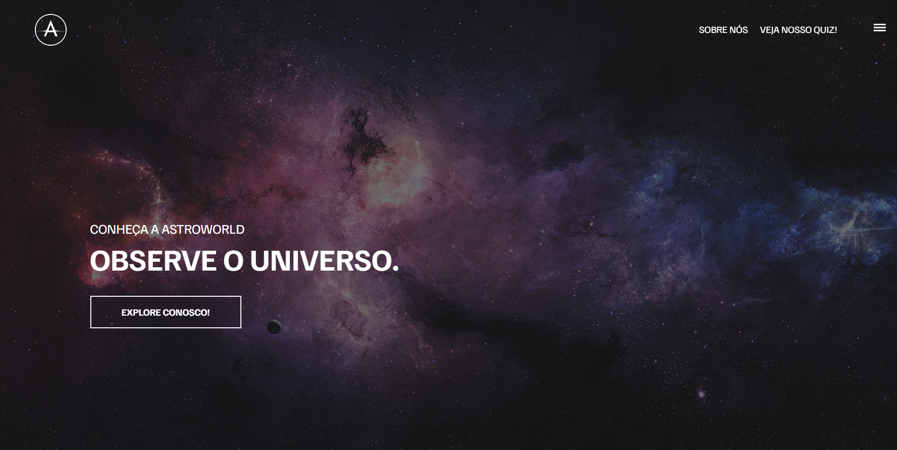

<<<<<<< HEAD
# ASTROWORLD  

 
 
 - TCC do Curso Técnico em Desenvolvimento de Sistemas da ETEC Sapopemba

 ## Objetivo
Nosso objetivo com este projeto é disseminar o conhecimento da Astronomia de forma democrática. Utilizando HTML, CSS e JS, o projeto 
inclui um site interativo e um jogo desenvolvido na plataforma GameMaker. A problemática abordada é a falta de recursos 
educacionais práticos na astronomia. 
As bases tecnológicas buscam superar essa 
barreira, oferecendo experiências envolventes. Redes sociais como Instagram, 
Facebook e TikTok são exploradas para amplificar o alcance, promovendo a 
interatividade e o engajamento. O AstroWorld emerge como uma plataforma 
inovadora, transcendendo a educação astronômica tradicional e inspirando uma nova 
geração de entusiastas.

## Equipe
> Davi Gabriel,
Daniel Reis,
Eduardo Dominguês,
Fellype Oliveira,
Gustavo Melo,
João Tarquini,
Wender Santos

## Funções
- **Daniel Reis**: Pesquisa e Desenvolvimento das partes do Site: **Sobre Nós** e **Sistema Solar**
-----
- **Davi Gabriel**: Pesquisa e Desenvolvimento do jogo feito na Plataforma **Gamemaker**
-----
- **Eduardo Dominguês**: Pesquisa e Desenvolvimento do **Artigo**.
---
- **Fellype Oliveira**: Pesquisa e Desenvolvimento da parte do Site: **Fenômenos** e criação de conteúdo no **Instagram** e **Tiktok**
---
- **Gustavo Melo**: Pesquisa e Desenvolvimento da parte do Site: **História da Astronomia**
------
- **João Tarquini**: Ajuda na Pesquisa e Desenvolvimento do **Artigo** e **Redes Sociais**
------
- **Wender Santos**: Pesquisa e Desenvolvimento das partes do Site: **Profissões e Gravidade**

## Acesso
[Clique aqui para acessar! :)](https://astroworld-tcc.vercel.app/)

## Tecnologias

- HTML
- CSS
- Git e Github
- JavaScript

## Contato
- Davi Gabriel:
[(Instagram)](https://www.instagram.com/gabrieldavi___/)
- Daniel Reis
[(Instagram)](https://www.instagram.com/_daaniel.xz/)
- Eduardo Dominguês
[(Instagram)](https://www.instagram.com/d.ominguesedu/)
- Fellype:
[(LinkedIn)](https://www.linkedin.com/in/fellype-oliveira-920699230/)
- Gustavo Melo
[(Instagram)](https://www.instagram.com/gustavofmelo_/)
- João Tarquini
[(Instagram)](https://www.instagram.com/j_tarquini08/)
- Wender Santos
[(Instagram)](https://www.instagram.com/wender1903/)
=======
# 🌌 AstroWorld - Explorando o Universo de Forma Interativa

## 🛰️ **Sobre o Projeto**

Este projeto foi desenvolvido como parte do **Trabalho de Conclusão de Curso (TCC)** do **Curso Técnico em Desenvolvimento de Sistemas da ETEC Sapopemba**. O **AstroWorld** busca democratizar o conhecimento da astronomia, tornando-o acessível e interativo. 

### 🎯 **Objetivo**

O objetivo do projeto é oferecer recursos práticos e envolventes para o ensino da astronomia. Ele inclui:

- Um site interativo construído com **HTML**, **CSS**, **Bootstrap** e **JavaScript**.
- Um jogo desenvolvido na plataforma **GameMaker**.

A problemática abordada é a **falta de recursos educacionais práticos** nessa área. Para superar essa barreira, aproveitamos a tecnologia para criar experiências imersivas e explorar redes sociais como **Instagram**, **Facebook** e **TikTok**, promovendo interatividade e engajamento.

O **AstroWorld** não é apenas um recurso educacional; é uma plataforma inovadora que transcende o ensino tradicional e inspira uma nova geração de entusiastas da astronomia.

---

## 🧑‍🤝‍🧑 **Equipe**

- **Davi Gabriel**: Pesquisa e desenvolvimento do jogo no GameMaker.
- **Daniel Reis**: Pesquisa e desenvolvimento das seções "Sobre Nós" e "Sistema Solar" do site.
- **Eduardo Dominguês**: Pesquisa e desenvolvimento do artigo científico.
- **Fellype Oliveira**: Pesquisa e desenvolvimento da seção "Fenômenos" do site, além de criação de conteúdo para Instagram e TikTok.
- **Gustavo Melo**: Pesquisa e desenvolvimento da seção "História da Astronomia" do site.
- **João Tarquini**: Apoio na pesquisa e desenvolvimento do artigo e das redes sociais.
- **Wender Santos**: Pesquisa e desenvolvimento das seções "Profissões" e "Gravidade" do site.

---

## 🌐 **Acesso**

🔗 [Clique aqui para acessar o AstroWorld!](https://astroworld-tcc.vercel.app/)

---

## 🚀 **Tecnologias Utilizadas**

- **HTML**  
- **CSS**  
- **JavaScript**
- **Bootstrap** 
- **Git** e **GitHub**  
- **GameMaker**  

---

## 📱 **Redes Sociais**

- **Instagram**: [@astroworld_tcc](https://www.instagram.com/astroworld_tcc/)

---

>>>>>>> a09f62e1a1e994562a37b6b455ab623a868cc7a2
